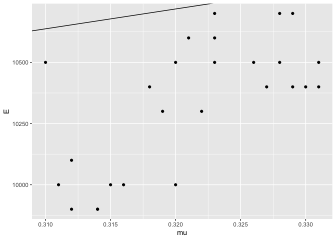
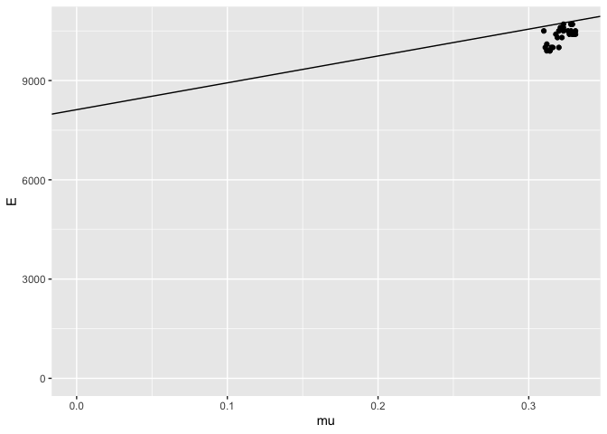
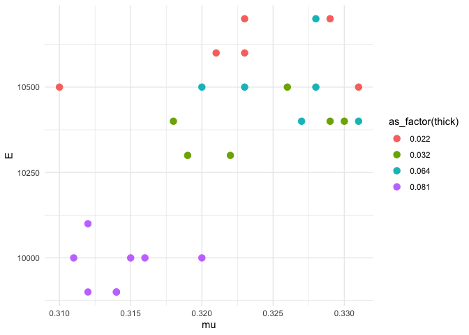

Aluminum Data
================
(Your name here)
2020-

  - [Grading Rubric](#grading-rubric)
      - [Individual](#individual)
      - [Team](#team)
      - [Due Date](#due-date)
  - [Loading and Wrangle](#loading-and-wrangle)
  - [EDA](#eda)
      - [Initial checks](#initial-checks)
      - [Visualize](#visualize)
  - [References](#references)

*Purpose*: When designing structures such as bridges, boats, and planes,
the design team needs data about *material properties*. Often when we
engineers first learn about material properties through coursework, we
talk about abstract ideas and look up values in tables without ever
looking at the data that gave rise to published properties. In this
challenge you’ll study an aluminum alloy dataset: Studying these data
will give you a better sense of the challenges underlying published
material values.

In this challenge, you will load a real dataset, wrangle it into tidy
form, and perform EDA to learn more about the data.

<!-- include-rubric -->

# Grading Rubric

<!-- -------------------------------------------------- -->

Unlike exercises, **challenges will be graded**. The following rubrics
define how you will be graded, both on an individual and team basis.

## Individual

<!-- ------------------------- -->

| Category    | Unsatisfactory                                                                   | Satisfactory                                                               |
| ----------- | -------------------------------------------------------------------------------- | -------------------------------------------------------------------------- |
| Effort      | Some task **q**’s left unattempted                                               | All task **q**’s attempted                                                 |
| Observed    | Did not document observations                                                    | Documented observations based on analysis                                  |
| Supported   | Some observations not supported by analysis                                      | All observations supported by analysis (table, graph, etc.)                |
| Code Styled | Violations of the [style guide](https://style.tidyverse.org/) hinder readability | Code sufficiently close to the [style guide](https://style.tidyverse.org/) |

## Team

<!-- ------------------------- -->

| Category   | Unsatisfactory                                                                                   | Satisfactory                                       |
| ---------- | ------------------------------------------------------------------------------------------------ | -------------------------------------------------- |
| Documented | No team contributions to Wiki                                                                    | Team contributed to Wiki                           |
| Referenced | No team references in Wiki                                                                       | At least one reference in Wiki to member report(s) |
| Relevant   | References unrelated to assertion, or difficult to find related analysis based on reference text | Reference text clearly points to relevant analysis |

## Due Date

<!-- ------------------------- -->

All the deliverables stated in the rubrics above are due on the day of
the class discussion of that exercise. See the
[Syllabus](https://docs.google.com/document/d/1jJTh2DH8nVJd2eyMMoyNGroReo0BKcJrz1eONi3rPSc/edit?usp=sharing)
for more information.

``` r
library(tidyverse)
```

    ## ── Attaching packages ────────────────────────────────────────── tidyverse 1.3.0 ──

    ## ✓ ggplot2 3.3.2     ✓ purrr   0.3.4
    ## ✓ tibble  3.0.1     ✓ dplyr   1.0.0
    ## ✓ tidyr   1.1.0     ✓ stringr 1.4.0
    ## ✓ readr   1.3.1     ✓ forcats 0.5.0

    ## ── Conflicts ───────────────────────────────────────────── tidyverse_conflicts() ──
    ## x dplyr::filter() masks stats::filter()
    ## x dplyr::lag()    masks stats::lag()

*Background*: In 1946, scientists at the Bureau of Standards tested a
number of Aluminum plates to determine their
[elasticity](https://en.wikipedia.org/wiki/Elastic_modulus) and
[Poisson’s ratio](https://en.wikipedia.org/wiki/Poisson%27s_ratio).
These are key quantities used in the design of structural members, such
as aircraft skin under [buckling
loads](https://en.wikipedia.org/wiki/Buckling). These scientists tested
plats of various thicknesses, and at different angles with respect to
the [rolling](https://en.wikipedia.org/wiki/Rolling_\(metalworking\))
direction.

# Loading and Wrangle

<!-- -------------------------------------------------- -->

The `readr` package in the Tidyverse contains functions to load data
form many sources. The `read_csv()` function will help us load the data
for this challenge.

``` r
## NOTE: If you extracted all challenges to the same location,
## you shouldn't have to change this filename
filename <- "./data/stang.csv"

## Load the data
df_stang <- read_csv(filename)
```

    ## Parsed with column specification:
    ## cols(
    ##   thick = col_double(),
    ##   E_00 = col_double(),
    ##   mu_00 = col_double(),
    ##   E_45 = col_double(),
    ##   mu_45 = col_double(),
    ##   E_90 = col_double(),
    ##   mu_90 = col_double(),
    ##   alloy = col_character()
    ## )

``` r
df_stang
```

    ## # A tibble: 9 x 8
    ##   thick  E_00 mu_00  E_45  mu_45  E_90 mu_90 alloy  
    ##   <dbl> <dbl> <dbl> <dbl>  <dbl> <dbl> <dbl> <chr>  
    ## 1 0.022 10600 0.321 10700  0.329 10500 0.31  al_24st
    ## 2 0.022 10600 0.323 10500  0.331 10700 0.323 al_24st
    ## 3 0.032 10400 0.329 10400  0.318 10300 0.322 al_24st
    ## 4 0.032 10300 0.319 10500  0.326 10400 0.33  al_24st
    ## 5 0.064 10500 0.323 10400  0.331 10400 0.327 al_24st
    ## 6 0.064 10700 0.328 10500  0.328 10500 0.32  al_24st
    ## 7 0.081 10000 0.315 10000  0.32   9900 0.314 al_24st
    ## 8 0.081 10100 0.312  9900  0.312 10000 0.316 al_24st
    ## 9 0.081 10000 0.311    -1 -1      9900 0.314 al_24st

Note that these data are not tidy\! The data in this form are convenient
for reporting in a table, but are not ideal for analysis.

**q1** Tidy `df_stang` to produce `df_stang_long`. You should have
column names `thick, alloy, angle, E, mu`. Make sure the `angle`
variable is of correct type. Filter out any invalid values.

*Hint*: You can reshape in one `pivot` using the `".value"` special
value for `names_to`.

``` r
## TASK: Tidy `df_stang`
df_stang_long <-
  df_stang %>%
  pivot_longer(
    names_to = c(".value", "angle"),
    names_sep = "_",
    names_transform = list(angle = as.integer),
    cols = c(2:7)
  ) %>%
  filter(E > 0)


df_stang_long
```

    ## # A tibble: 26 x 5
    ##    thick alloy   angle     E    mu
    ##    <dbl> <chr>   <int> <dbl> <dbl>
    ##  1 0.022 al_24st     0 10600 0.321
    ##  2 0.022 al_24st    45 10700 0.329
    ##  3 0.022 al_24st    90 10500 0.31 
    ##  4 0.022 al_24st     0 10600 0.323
    ##  5 0.022 al_24st    45 10500 0.331
    ##  6 0.022 al_24st    90 10700 0.323
    ##  7 0.032 al_24st     0 10400 0.329
    ##  8 0.032 al_24st    45 10400 0.318
    ##  9 0.032 al_24st    90 10300 0.322
    ## 10 0.032 al_24st     0 10300 0.319
    ## # … with 16 more rows

Use the following tests to check your work.

``` r
## NOTE: No need to change this
## Names
assertthat::assert_that(
              setequal(
                df_stang_long %>% names,
                c("thick", "alloy", "angle", "E", "mu")
              )
            )
```

    ## [1] TRUE

``` r
## Dimensions
assertthat::assert_that(all(dim(df_stang_long) == c(26, 5)))
```

    ## [1] TRUE

``` r
## Type
assertthat::assert_that(
              (df_stang_long %>% pull(angle) %>% typeof()) == "integer"
            )
```

    ## [1] TRUE

``` r
print("Very good!")
```

    ## [1] "Very good!"

# EDA

<!-- -------------------------------------------------- -->

## Initial checks

<!-- ------------------------- -->

**q2** Perform a basic EDA on the aluminum data *without visualization*.
Use your analysis to answer the questions under *observations* below. In
addition, add your own question that you’d like to answer about the
data.

``` r
glimpse(df_stang_long)
```

    ## Rows: 26
    ## Columns: 5
    ## $ thick <dbl> 0.022, 0.022, 0.022, 0.022, 0.022, 0.022, 0.032, 0.032, 0.032, …
    ## $ alloy <chr> "al_24st", "al_24st", "al_24st", "al_24st", "al_24st", "al_24st…
    ## $ angle <int> 0, 45, 90, 0, 45, 90, 0, 45, 90, 0, 45, 90, 0, 45, 90, 0, 45, 9…
    ## $ E     <dbl> 10600, 10700, 10500, 10600, 10500, 10700, 10400, 10400, 10300, …
    ## $ mu    <dbl> 0.321, 0.329, 0.310, 0.323, 0.331, 0.323, 0.329, 0.318, 0.322, …

``` r
df_stang_long %>% count(alloy)
```

    ## # A tibble: 1 x 2
    ##   alloy       n
    ##   <chr>   <int>
    ## 1 al_24st    26

``` r
df_stang_long %>% group_by(angle) %>% summarize()
```

    ## `summarise()` ungrouping output (override with `.groups` argument)

    ## # A tibble: 3 x 1
    ##   angle
    ##   <int>
    ## 1     0
    ## 2    45
    ## 3    90

**Observations**:

  - Is there “one true value” for the material properties of Aluminum?
    No. They are empirical and observed.
  - How many aluminum alloys were tested? How do you know? 1 alloy.
    Every row has the same value for alloy.
  - What angles were tested? 0, 45, and 90 degrees
  - What thicknesses were tested? .022“, .032”, .064“, .081”
  - What happened with the trial that resulted in E = -1?

## Visualize

<!-- ------------------------- -->

**q3** Create a visualization to investigate your question from q1
above. Can you find an answer to your question using the dataset? Would
you need additional information to answer your question?

``` r
# E = 2G(1 + mu)
G <- 4060

df_stang_long %>%
  ggplot() +
  geom_point(mapping = aes(x = mu, y = E)) +
  geom_abline(intercept = 2*G, slope = 2*G)
```

<!-- -->

``` r
df_stang_long %>%
  ggplot() +
  geom_point(mapping = aes(x = mu, y = E)) +
  expand_limits(x = 0, y = 0) +
  geom_abline(intercept = 2*G, slope = 2*G)
```

<!-- -->

**Observations**:

The relationship is not too far off the textbook equation: E = 2G(1 + )
<http://asm.matweb.com/search/SpecificMaterial.asp?bassnum=MA2024T3>

Note: It appears that most sources I’ve found use to refer to Poisson’s
ratio, whereas the data frame here uses “mu” (). Confusingly, G, the
shear coefficient, is sometimes also known as , so we use G here.

**q4** Consider the following statement:

“A material’s property (or material property) is an intensive property
of some material, i.e. a physical property that does not depend on the
amount of the material.”\[2\]

Note that the “amount of material” would vary with the thickness of a
tested plate. Does the following graph support or contradict the claim
that “elasticity `E` is an intensive material property.” Why or why not?
Is this evidence *conclusive* one way or another? Why or why not?

``` r
## NOTE: No need to change; run this chunk
df_stang_long %>%

  ggplot(aes(mu, E, color = as_factor(thick))) +
  geom_point(size = 3) +
  theme_minimal()
```

<!-- -->

**Observations**:

  - Does this graph support or contradict the claim above?

It’s unclear to me. For thickness 0.081“, it seems that E is clustered
around \~10,000 kpi. But for thicknesses 0.022”, 0.032“, and 0.064”,
they’re more intermingled.

# References

<!-- -------------------------------------------------- -->

\[1\] Stang, Greenspan, and Newman, “Poisson’s ratio of some structural
alloys for large strains” (1946) Journal of Research of the National
Bureau of Standards, (pdf
link)\[<https://nvlpubs.nist.gov/nistpubs/jres/37/jresv37n4p211_A1b.pdf>\]

\[2\] Wikipedia, *List of material properties*, accessed 2020-06-26,
(link)\[<https://en.wikipedia.org/wiki/List_of_materials_properties>\]
