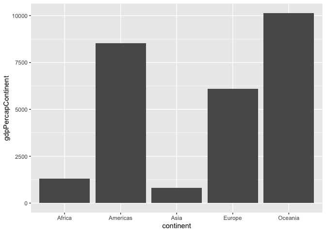
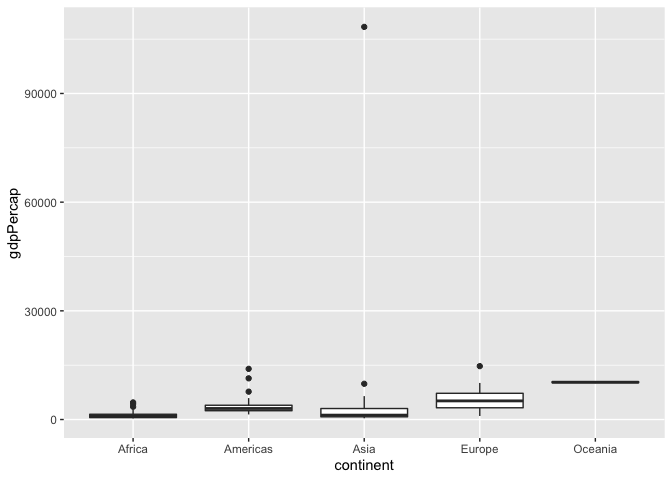
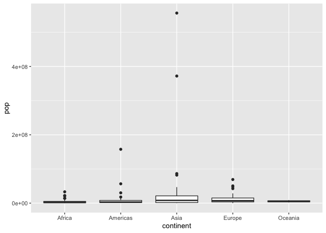
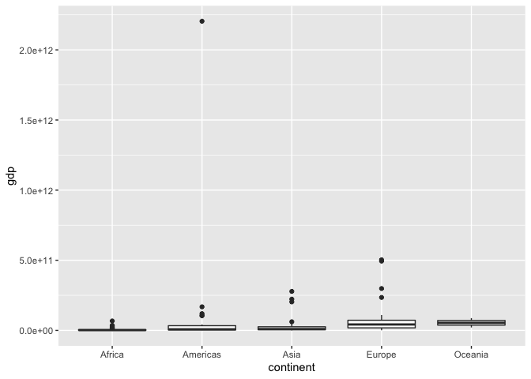

Gapminder
================
(Your name here)
2020-

  - [Grading Rubric](#grading-rubric)
      - [Individual](#individual)
      - [Team](#team)
      - [Due Date](#due-date)
  - [Guided EDA](#guided-eda)
  - [Your Own EDA](#your-own-eda)

*Purpose*: Learning to do EDA well takes practice\! In this challenge
you’ll further practice EDA by first completing a guided exploration,
then by conducting your own investigation. This challenge will also give
you a chance to use the wide variety of visual tools we’ve been
learning.

<!-- include-rubric -->

# Grading Rubric

<!-- -------------------------------------------------- -->

Unlike exercises, **challenges will be graded**. The following rubrics
define how you will be graded, both on an individual and team basis.

## Individual

<!-- ------------------------- -->

| Category    | Unsatisfactory                                                                   | Satisfactory                                                               |
| ----------- | -------------------------------------------------------------------------------- | -------------------------------------------------------------------------- |
| Effort      | Some task **q**’s left unattempted                                               | All task **q**’s attempted                                                 |
| Observed    | Did not document observations                                                    | Documented observations based on analysis                                  |
| Supported   | Some observations not supported by analysis                                      | All observations supported by analysis (table, graph, etc.)                |
| Code Styled | Violations of the [style guide](https://style.tidyverse.org/) hinder readability | Code sufficiently close to the [style guide](https://style.tidyverse.org/) |

## Team

<!-- ------------------------- -->

| Category   | Unsatisfactory                                                                                   | Satisfactory                                       |
| ---------- | ------------------------------------------------------------------------------------------------ | -------------------------------------------------- |
| Documented | No team contributions to Wiki                                                                    | Team contributed to Wiki                           |
| Referenced | No team references in Wiki                                                                       | At least one reference in Wiki to member report(s) |
| Relevant   | References unrelated to assertion, or difficult to find related analysis based on reference text | Reference text clearly points to relevant analysis |

## Due Date

<!-- ------------------------- -->

All the deliverables stated in the rubrics above are due on the day of
the class discussion of that exercise. See the
[Syllabus](https://docs.google.com/document/d/1jJTh2DH8nVJd2eyMMoyNGroReo0BKcJrz1eONi3rPSc/edit?usp=sharing)
for more information.

``` r
library(tidyverse)
```

    ## ── Attaching packages ───────────────────────────────────────────────────────────────────────────── tidyverse 1.3.0 ──

    ## ✓ ggplot2 3.3.2     ✓ purrr   0.3.4
    ## ✓ tibble  3.0.1     ✓ dplyr   1.0.0
    ## ✓ tidyr   1.1.0     ✓ stringr 1.4.0
    ## ✓ readr   1.3.1     ✓ forcats 0.5.0

    ## ── Conflicts ──────────────────────────────────────────────────────────────────────────────── tidyverse_conflicts() ──
    ## x dplyr::filter() masks stats::filter()
    ## x dplyr::lag()    masks stats::lag()

``` r
library(gapminder)
```

*Background*: [Gapminder](https://www.gapminder.org/about-gapminder/) is
an independent organization that seeks to education people about the
state of the world. They promote a “fact-based worldview” by focusing on
data. The dataset we’ll study in this challenge is from Gapminder.

# Guided EDA

<!-- -------------------------------------------------- -->

First, we’ll go through a round of *guided EDA*. Try to pay attention to
the high-level process we’re going through—after this guided round
you’ll be responsible for doing another cycle of EDA on your own\!

**q0** Perform your “first checks” on the dataset. What variables are in
this dataset?

``` r
glimpse(gapminder)
```

    ## Rows: 1,704
    ## Columns: 6
    ## $ country   <fct> Afghanistan, Afghanistan, Afghanistan, Afghanistan, Afghani…
    ## $ continent <fct> Asia, Asia, Asia, Asia, Asia, Asia, Asia, Asia, Asia, Asia,…
    ## $ year      <int> 1952, 1957, 1962, 1967, 1972, 1977, 1982, 1987, 1992, 1997,…
    ## $ lifeExp   <dbl> 28.801, 30.332, 31.997, 34.020, 36.088, 38.438, 39.854, 40.…
    ## $ pop       <int> 8425333, 9240934, 10267083, 11537966, 13079460, 14880372, 1…
    ## $ gdpPercap <dbl> 779.4453, 820.8530, 853.1007, 836.1971, 739.9811, 786.1134,…

**Observations**:

  - Write the variable names here country, continent, year, lifeExp,
    pop, gdpPercap

**q1** Determine the most and least recent years in the `gapminder`
dataset.

``` r
## TASK: Find the largest and smallest values of `year` in `gapminder`
year_max <- gapminder %>%
  select(year) %>%
  summarize(max(year))

year_min <- gapminder %>%
  select(year) %>%
  summarize(min(year))

year_min
```

    ## # A tibble: 1 x 1
    ##   `min(year)`
    ##         <int>
    ## 1        1952

``` r
year_max
```

    ## # A tibble: 1 x 1
    ##   `max(year)`
    ##         <int>
    ## 1        2007

Use the following test to check your work.

``` r
## NOTE: No need to change this
assertthat::assert_that(year_max %% 7 == 5)
```

    ## [1] TRUE

``` r
assertthat::assert_that(year_max %% 3 == 0)
```

    ## [1] TRUE

``` r
assertthat::assert_that(year_min %% 7 == 6)
```

    ## [1] TRUE

``` r
assertthat::assert_that(year_min %% 3 == 2)
```

    ## [1] TRUE

``` r
print("Nice!")
```

    ## [1] "Nice!"

**q2** Filter on years matching `year_min`, and make a plot of the GDE
per capita against continent. Choose an appropriate `geom_` to visualize
the data. What observations can you make?

You may encounter difficulties in visualizing these data; if so document
your challenges and attempt to produce the most informative visual you
can.

``` r
## TASK: Create a visual of gdpPercap vs continent
gapminder %>%
  filter(year %in% year_min) %>%
  select(continent, gdpPercap, pop) %>%
  mutate(
    gdp = gdpPercap * pop,
  ) %>%
  group_by(continent) %>%
  summarize(
    gdpContinent = sum(gdp),
    popContinent = sum(pop)
  ) %>%
  mutate(
    gdpPercapContinent = gdpContinent / popContinent
  ) %>%
  ggplot() +
  geom_col(aes(y = gdpPercapContinent, x = continent))
```

    ## `summarise()` ungrouping output (override with `.groups` argument)

<!-- -->

**Observations**:

GDP Per Cap World Championships ranking:

1: Oceania 2: Americas 3: Europe 4: Africa 5: Asia

**Difficulties & Approaches**:

  - Write your challenges and your approach to solving them

Adding the GDPs Per Cap of countries across a continent and trying to
treat that like the GDP per Cap of the Continent doesn’t work, because
it would give equal weighting to each country on the continent. Instead,
we calculate the GDP of each country and add them together to get the
GDP of the continent, and divide it by the sum of populations to get the
continental GDP.

**q3** You should have found at least three outliers in q2. Identify
those outliers (figure out which countries they are).

``` r
## TASK: Identify the outliers from q2

minYear_df <-
  gapminder %>%
  filter(year %in% year_min)

# GDP Per Cap

top3gdpPercap <-
  minYear_df %>%
  filter(rank(desc(gdpPercap)) < 4)
top3gdpPercap
```

    ## # A tibble: 3 x 6
    ##   country       continent  year lifeExp       pop gdpPercap
    ##   <fct>         <fct>     <int>   <dbl>     <int>     <dbl>
    ## 1 Kuwait        Asia       1952    55.6    160000   108382.
    ## 2 Switzerland   Europe     1952    69.6   4815000    14734.
    ## 3 United States Americas   1952    68.4 157553000    13990.

``` r
minYear_df %>%
  ggplot() +
  geom_boxplot(aes(x = continent, y = gdpPercap))
```

<!-- -->

``` r
# Pop
top3pop <-
  minYear_df %>%
  filter(rank(desc(pop)) < 4)
top3pop
```

    ## # A tibble: 3 x 6
    ##   country       continent  year lifeExp       pop gdpPercap
    ##   <fct>         <fct>     <int>   <dbl>     <int>     <dbl>
    ## 1 China         Asia       1952    44   556263527      400.
    ## 2 India         Asia       1952    37.4 372000000      547.
    ## 3 United States Americas   1952    68.4 157553000    13990.

``` r
minYear_df %>%
  ggplot() +
  geom_boxplot(aes(x = continent, y = pop))
```

<!-- -->

``` r
# GDP
top3gdp <-
  minYear_df %>%
  mutate(
    gdp = gdpPercap * pop
  ) %>%
  filter(rank(desc(gdp)) < 4)

top3gdp
```

    ## # A tibble: 3 x 7
    ##   country        continent  year lifeExp       pop gdpPercap     gdp
    ##   <fct>          <fct>     <int>   <dbl>     <int>     <dbl>   <dbl>
    ## 1 Germany        Europe     1952    67.5  69145952     7144. 4.94e11
    ## 2 United Kingdom Europe     1952    69.2  50430000     9980. 5.03e11
    ## 3 United States  Americas   1952    68.4 157553000    13990. 2.20e12

``` r
minYear_df %>%
  mutate(
    gdp = gdpPercap * pop
  ) %>%
  ggplot() +
  geom_boxplot(aes(x = continent, y = gdp))
```

<!-- -->

**Observations**:

  - Identify the outlier countries from q2 Kuwait, Switzerland, United
    States (gdp/cap) China, India, US (pop) Germany, UK, US (gdp total)

**q4** Create a plot similar to yours from q2 studying both `year_min`
and `year_max`. Find a way to highlight the outliers from q3 on your
plot. Compare the patterns between `year_min` and `year_max`.

*Hint*: We’ve learned a lot of different ways to show multiple
variables; think about using different aesthetics or facets.

``` r
## TASK: Create a visual of gdpPercap vs continent

gapminder %>%
  filter(year %in% year_min) %>%
  select(continent, gdpPercap, pop) %>%
  mutate(
    gdp = gdpPercap * pop,
  ) %>%
  group_by(continent) %>%
  summarize(
    gdpContinent = sum(gdp),
    popContinent = sum(pop)
  ) %>%
  mutate(
    gdpPercapContinent = gdpContinent / popContinent
  ) %>%
  ggplot() +
  geom_col(aes(y = gdpPercapContinent, x = continent))
```

    ## `summarise()` ungrouping output (override with `.groups` argument)

<!-- -->

**Observations**:

  - Write your observations here

# Your Own EDA

<!-- -------------------------------------------------- -->

Now it’s your turn\! We just went through guided EDA considering the GDP
per capita at two time points. You can continue looking at outliers,
consider different years, repeat the exercise with `lifeExp`, consider
the relationship between variables, or something else entirely.

**q5** Create *at least* three new figures below. With each figure, try
to pose new questions about the data.

``` r
## TASK: Your first graph
```

``` r
## TASK: Your second graph
```

``` r
## TASK: Your third graph
```
